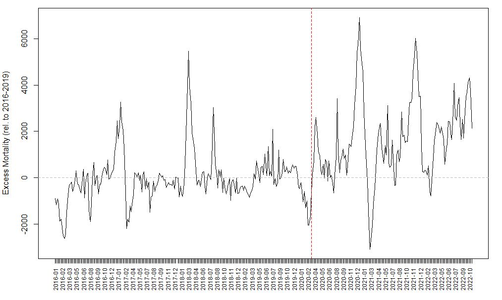

# Analysis of Excess Mortality in Germany 2016-2022 using (base) R

## Introduction
Mortality varies within each year and also across years. The Covid-19 pandemic has changed seasonal patterns of mortality (at least this is the presumption here). I investigate seasonal excess mortality using a simple linear regression model using the period 2016 to 2019 (before the Covid-19 pandemic) as a baseline.

## Data
Mortality data for Germany are published by the [German Statistical Office (Destatis)](https://www.destatis.de/DE/Themen/Gesellschaft-Umwelt/Bevoelkerung/Sterbefaelle-Lebenserwartung/Tabellen/sonderauswertung-sterbefaelle.html). Destatis provides a (not well formated) Excel file containing mortality figures in several stratas (by time, by age etc). I use aggregated mortality figures (all age groups) on a weekly basis to investigate seasonal excess mortality.

## Data Preparation
Before I start, I need to prepare the data. I first read the Excel file into R, select the respective sheet, and drop a few lines which are headers. The next steps can be followed based on the comments in the code below. Essentially, I end up with a dataframe in long format, which contains a values of deaths per week from 2016 to 2022.

```
library(readxl)
roh <- read_excel("C:/Users/User/Downloads/sonderauswertung-sterbefaelle.xlsx", 
                    sheet = "D_2016_2022_KW_AG_Ins", col_names = FALSE, skip = 8)

# Get header with ISO weeks
header = roh[1,]
# select values of sums over age groups named "Insgesamt"
sums = roh[grep("Insgesamt", roh$...3),]

# Bind data
tmp = rbind(header,sums)
tmp = tmp[,2:ncol(tmp)]
tmp = tmp[,-2]
tmp = data.frame(tmp)
tmp[1,1]<-"nn"

# Set row names (years)
row.names(tmp)<-tmp[,1]
tmp = tmp[,-1]

# Set column names (ISO week per year)
colnames(tmp) <- tmp[1,]
tmp = tmp[-1,]

# Drop week 53 
tmp <- tmp[,-53]

# Set up empty dataframe
# y = year, w = week, v = value
df = data.frame(y=NA,w=NA,v=NA)

# Fill dataframe (aka "wide" to "long")
counter = 1
for (y in row.names(tmp)){
  for (w in colnames(tmp)){
    df[counter,"y"] <- y
    df[counter,"w"] <- w
    df[counter,"v"] <- tmp[[y,w]]
    counter = counter + 1
  }
}

# Drop missing values in 2022
df = df[!is.na(df$v),]
``` 

## Model
In order to assess excess mortality, I estimate a simple OLS model using data from 2016 to 2019 (time before Covid-19) in order to get a reasonable baseline for what would be the expected (viz. average) mortality for a given ISO week.

```
# Split pre/post Covid
df_pre = df[df$y<2020,]
df_post = df[df$y>=2020,]

# Estimate OLS model
reg = lm(v ~ as.factor(w),data=df_pre)
summary(reg)
```

The OLS model essentially looks like:
```math
y_i = \beta_0 + \beta_1 w_i + u_i,
```
where w is the ISO week (as a factor). Thus, the average mortality for each week from 2016 to 2019 serves as the baseline here.

## Prediction

I use the the "pre-Covid" baseline model to make predictions for both periods (pre-Covid and Covid).

```
# Prediction baseline
pred = predict(reg,newdata = df_pre)
pred_pre = data.frame(cbind(pred,df_pre))
pred_pre$date = paste0(pred_pre$y, "-", sprintf("%02d", as.numeric(pred_pre$w)))
pred_pre = pred_pre[order(pred_pre$date),]
plot(pred_pre$v)
lines(pred_pre$pred, col="blue")

# Prediction "post" on baseline
pred = predict(reg,newdata = df_post)
pred_post = data.frame(cbind(pred,df_post))
pred_post$date = paste0(pred_post$y, "-", sprintf("%02d", as.numeric(pred_post$w)))
pred_post = pred_post[order(pred_post$date),]
plot(pred_post$v)
lines(pred_post$pred, col="blue")
```

Now I cbind both predictions together and calculate the excess mortality, which is the actual mortality minus the expected mortality based on the baseline model for 2016 to 2019.

```
# Excess mortality based on baseline
all = rbind(pred_pre, pred_post)
all$excess = all$v - all$pred
all$n = seq(1,nrow(all))
all$date = as.Date(paste(all$y, all$w, 1, sep="-"), "%Y-%U-%u")
```

Finally, I plot the results.

```
plot(all$date, all$excess, type = "l", lty = 1, xaxt='n', xlab="", ylab="Excess MOrtality (rel. to 2016-2019)")
abline(h=0, col="gray", lwd=1.5, lty=2)
abline(v=as.numeric(as.Date("2020-03-15")), lwd=0.8, col='red', lty=2)
axis.Date(1,at=all$date,labels=format(all$date,"%Y-%m"),las=2, cex.axis = 0.75)
```

## Results and Conclusion

During the baseline period (2016 to 2019) we see clear peaks in winter 2016/17 and around March 2018, both are attributable to the flu season, which hitted hard in 2018. We also see a peak in summer 2018, where very high temperatures were observed over several weeks. With respect to the period 2020 onwards, the results show that there was partly high excess mortality in the winter 2020/21 as well as 2021/22 (both comparable to the flu-season of 2018) and a very low excess mortality in early spring 2021, likely as a result of the lockdown and attributable to the fact that the flu-season often extends to March and hitted hard in March 2018 (in the baseline period). We also see relatively high excess mortality towards the end of the year 2022 (October), well before the flu- or Covid-season observed in earlier years. Overall, excess mortality is somewhat higher on average since the start of Covid compared to the baseline period of 2016 to 2019.


